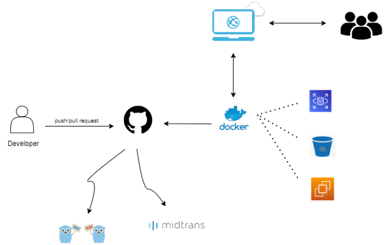
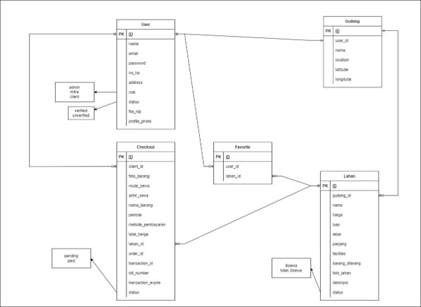

<!-- PROJECT LOGO -->

  

  <h1 align="center">WAREHOUSE APP</h1>

 

<!-- TABLE OF CONTENTS -->
## Table of Contents
1. [About](#about-the-project)
2. [High Level Architecture](#high-level-architecture)
3. [Entity Relationship Diagram](#entity-relationship-diagram)
4. [Swagger](#swagger)
5. [Tech Stack](#tech-stack)
6. [Business Layer](#business-layer)
7. [Unit Test](#unit-test)
8. [Collaborator](#collaborator)

<!-- ABOUT THE PROJECT -->
## About The Project
Warehouse App merupakan aplikasi penyedia jasa penitipan barang. Semua barang bisa dititipkan lewat Warehouse App, dari yang paling kecil sampai yang paling besar. Layanan ini menjawab berbagai masalah yang terjadi dalam penyimpanan, seperti penitip ingin menyimpan barang UKM agar bisa diakses mudah dari tempat usaha. Dan orang yang mempunyai space lebih yang tidak terpakai juga dapat mendaftar menjadi mitra gudang Warehouse App agar tidak kosong dengan sia-sia.

(<a href="#top">back to top</a>)

## High Level Architecture

(<a href="#top">back to top</a>)

## Entity Relationship Diagram

(<a href="#top">back to top</a>)

## Swagger
Link Swagger : https://app.swaggerhub.com/apis-docs/muhdwiar/WarehouseCapstoneProject/1.0.0#/

(<a href="#top">back to top</a>)

## Tech Stack

(<a href="#top">back to top</a>)

## Business Layer

(<a href="#top">back to top</a>)

## Unit Test
Hasil Coverage Dari Setiap Features :

(<a href="#top">back to top</a>)

<!-- CONTACT -->
## Collaborator
* Dian Nurdiana
* Muhamad Dwi Arifianto

(<a href="#top">back to top</a>)
